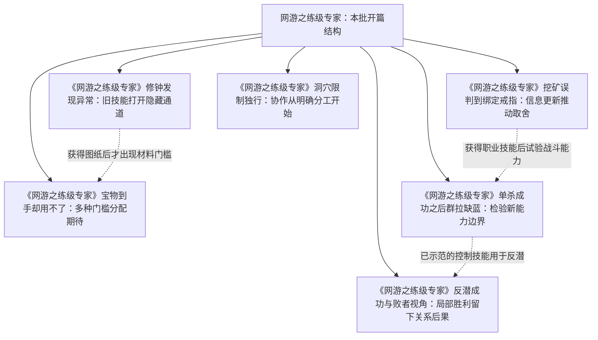

# 网游之练级专家 · 本次阅读范围内的因果与未解线

实线表示结构归属，虚线表示跨节点关系；依据类型详见节点数据。

```mermaid
flowchart TD
  n0["网游之练级专家：本批开篇结构"]
  n1["《网游之练级专家》修钟发现异常：旧技能打开隐藏通道"]
  n0 --> n1
  n2["《网游之练级专家》宝物到手却用不了：多种门槛分配期待"]
  n0 --> n2
  n3["《网游之练级专家》挖矿误判到绑定戒指：信息更新推动取舍"]
  n0 --> n3
  n4["《网游之练级专家》单杀成功之后群拉缺蓝：检验新能力边界"]
  n0 --> n4
  n5["《网游之练级专家》反潜成功与败者视角：局部胜利留下关系后果"]
  n0 --> n5
  n6["《网游之练级专家》洞穴限制独行：协作从明确分工开始"]
  n0 --> n6
  n1 -. "获得图纸后才出现材料门槛" .-> n2
  n3 -. "获得职业技能后试验战斗能力" .-> n4
  n4 -. "已示范的控制技能用于反潜" .-> n5
```

## 剧情线

- 生产积累转为战斗与协作：main / partial
- 尚未兑现的图纸与宝藏：subplot / open
- 败者的再战意向：hidden / open
