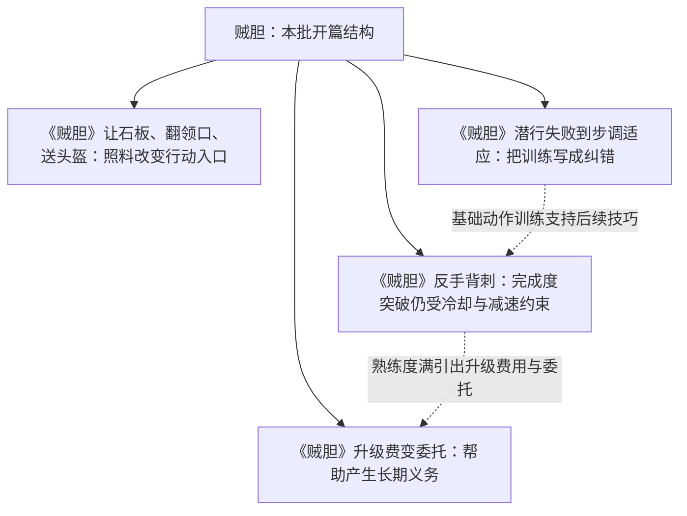

# 贼胆 · 本次阅读范围内的因果与未解线

实线表示结构归属，虚线表示跨节点关系；依据类型详见节点数据。

```mermaid
flowchart TD
  n0["贼胆：本批开篇结构"]
  n1["《贼胆》让石板、翻领口、送头盔：照料改变行动入口"]
  n0 --> n1
  n2["《贼胆》潜行失败到步调适应：把训练写成纠错"]
  n0 --> n2
  n3["《贼胆》反手背刺：完成度突破仍受冷却与减速约束"]
  n0 --> n3
  n4["《贼胆》升级费变委托：帮助产生长期义务"]
  n0 --> n4
  n2 -. "基础动作训练支持后续技巧" .-> n3
  n3 -. "熟练度满引出升级费用与委托" .-> n4
```

## 剧情线

- 正当收入与试玩期限：main / open
- 奥德失物与委托动机：hidden / open
