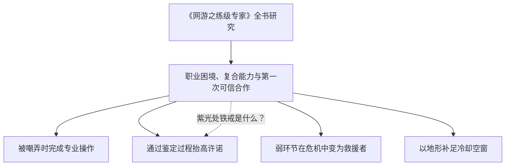

# 《网游之练级专家》职业困境、复合能力与第一次可信合作

实线表示结构归属，虚线表示跨节点关系；依据类型详见节点数据。

```mermaid
flowchart TD
  n0["《网游之练级专家》全书研究"]
  n1["职业困境、复合能力与第一次可信合作"]
  n0 --> n1
  n2["被嘲弄时完成专业操作"]
  n1 --> n2
  n3["通过鉴定过程抬高许诺"]
  n1 --> n3
  n4["弱环节在危机中变为救援者"]
  n1 --> n4
  n5["以地形补足冷却空窗"]
  n1 --> n5
  n1 -. "紫光处铁戒是什么？" .-> n3
```

## 剧情线
