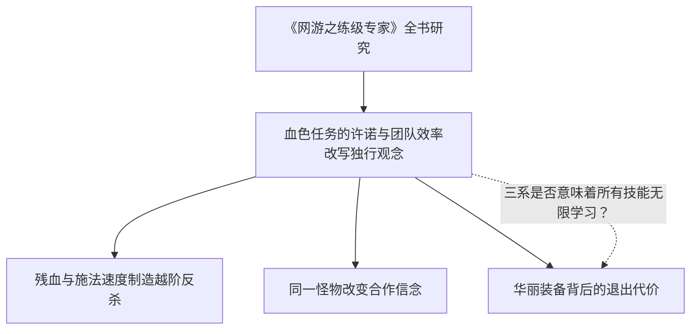

# 《网游之练级专家》血色任务的许诺与团队效率改写独行观念

实线表示结构归属，虚线表示跨节点关系；依据类型详见节点数据。

```mermaid
flowchart TD
  n0["《网游之练级专家》全书研究"]
  n1["血色任务的许诺与团队效率改写独行观念"]
  n0 --> n1
  n2["残血与施法速度制造越阶反杀"]
  n1 --> n2
  n3["同一怪物改变合作信念"]
  n1 --> n3
  n4["华丽装备背后的退出代价"]
  n1 --> n4
  n1 -. "三系是否意味着所有技能无限学习？" .-> n4
```

## 剧情线
