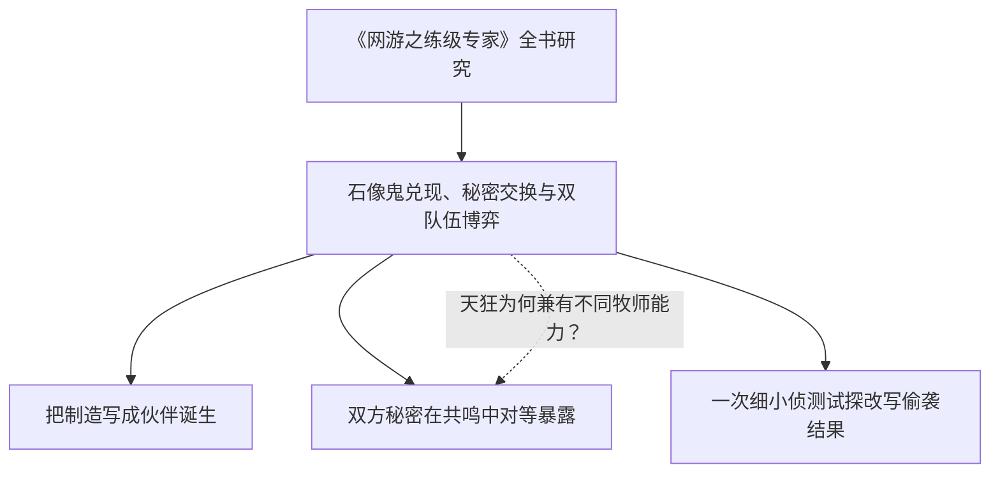

# 《网游之练级专家》石像鬼兑现、秘密交换与双队伍博弈

实线表示结构归属，虚线表示跨节点关系；依据类型详见节点数据。

```mermaid
flowchart TD
  n0["《网游之练级专家》全书研究"]
  n1["石像鬼兑现、秘密交换与双队伍博弈"]
  n0 --> n1
  n2["把制造写成伙伴诞生"]
  n1 --> n2
  n3["双方秘密在共鸣中对等暴露"]
  n1 --> n3
  n4["一次细小侦测试探改写偷袭结果"]
  n1 --> n4
  n1 -. "天狂为何兼有不同牧师能力？" .-> n3
```

## 剧情线
