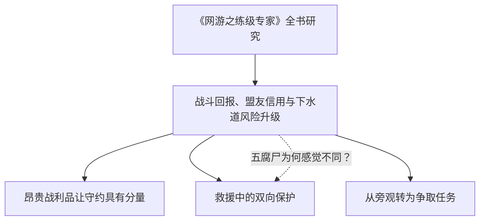

# 《网游之练级专家》战斗回报、盟友信用与下水道风险升级

实线表示结构归属，虚线表示跨节点关系；依据类型详见节点数据。

```mermaid
flowchart TD
  n0["《网游之练级专家》全书研究"]
  n1["战斗回报、盟友信用与下水道风险升级"]
  n0 --> n1
  n2["昂贵战利品让守约具有分量"]
  n1 --> n2
  n3["救援中的双向保护"]
  n1 --> n3
  n4["从旁观转为争取任务"]
  n1 --> n4
  n1 -. "五腐尸为何感觉不同？" .-> n3
```

## 剧情线
