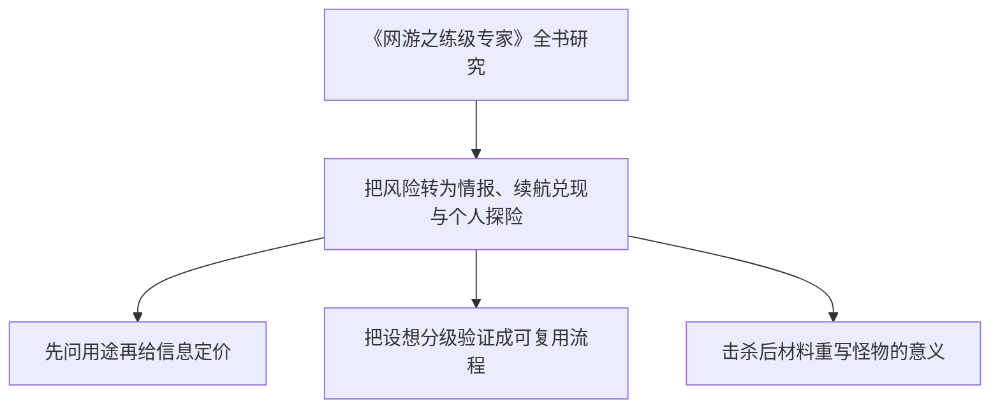

# 《网游之练级专家》把风险转为情报、续航兑现与个人探险

实线表示结构归属，虚线表示跨节点关系；依据类型详见节点数据。

```mermaid
flowchart TD
  n0["《网游之练级专家》全书研究"]
  n1["把风险转为情报、续航兑现与个人探险"]
  n0 --> n1
  n2["先问用途再给信息定价"]
  n1 --> n2
  n3["把设想分级验证成可复用流程"]
  n1 --> n3
  n4["击杀后材料重写怪物的意义"]
  n1 --> n4
```

## 剧情线
