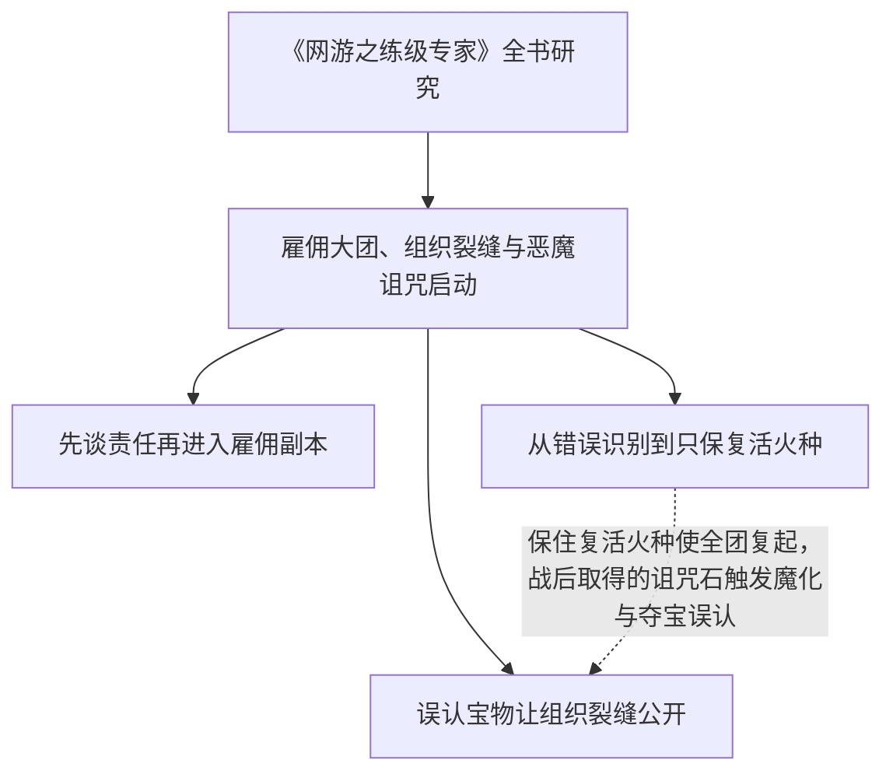

# 《网游之练级专家》雇佣大团、组织裂缝与恶魔诅咒启动

实线表示结构归属，虚线表示跨节点关系；依据类型详见节点数据。

```mermaid
flowchart TD
  n0["《网游之练级专家》全书研究"]
  n1["雇佣大团、组织裂缝与恶魔诅咒启动"]
  n0 --> n1
  n2["先谈责任再进入雇佣副本"]
  n1 --> n2
  n3["从错误识别到只保复活火种"]
  n1 --> n3
  n4["误认宝物让组织裂缝公开"]
  n1 --> n4
  n3 -. "保住复活火种使全团复起，战后取得的诅咒石触发魔化与夺宝误认" .-> n4
```

## 剧情线
