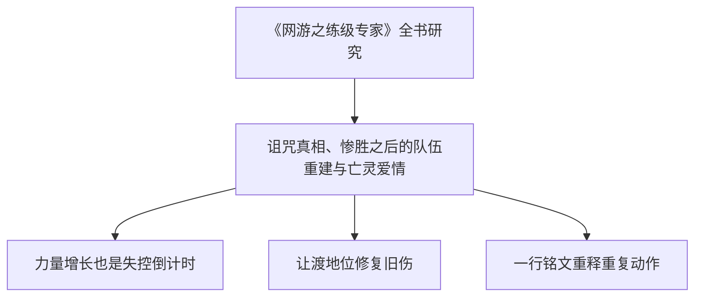

# 《网游之练级专家》诅咒真相、惨胜之后的队伍重建与亡灵爱情

实线表示结构归属，虚线表示跨节点关系；依据类型详见节点数据。

```mermaid
flowchart TD
  n0["《网游之练级专家》全书研究"]
  n1["诅咒真相、惨胜之后的队伍重建与亡灵爱情"]
  n0 --> n1
  n2["力量增长也是失控倒计时"]
  n1 --> n2
  n3["让渡地位修复旧伤"]
  n1 --> n3
  n4["一行铭文重释重复动作"]
  n1 --> n4
```

## 剧情线
