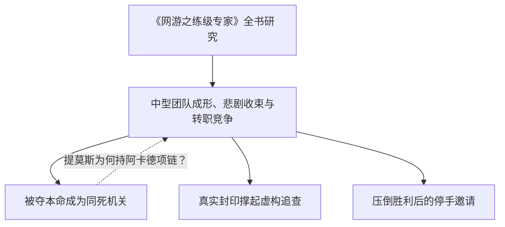

# 《网游之练级专家》中型团队成形、悲剧收束与转职竞争

实线表示结构归属，虚线表示跨节点关系；依据类型详见节点数据。

```mermaid
flowchart TD
  n0["《网游之练级专家》全书研究"]
  n1["中型团队成形、悲剧收束与转职竞争"]
  n0 --> n1
  n2["被夺本命成为同死机关"]
  n1 --> n2
  n3["真实封印撑起虚构追查"]
  n1 --> n3
  n4["压倒胜利后的停手邀请"]
  n1 --> n4
  n2 -. "提莫斯为何持阿卡德项链？" .-> n1
```

## 剧情线
