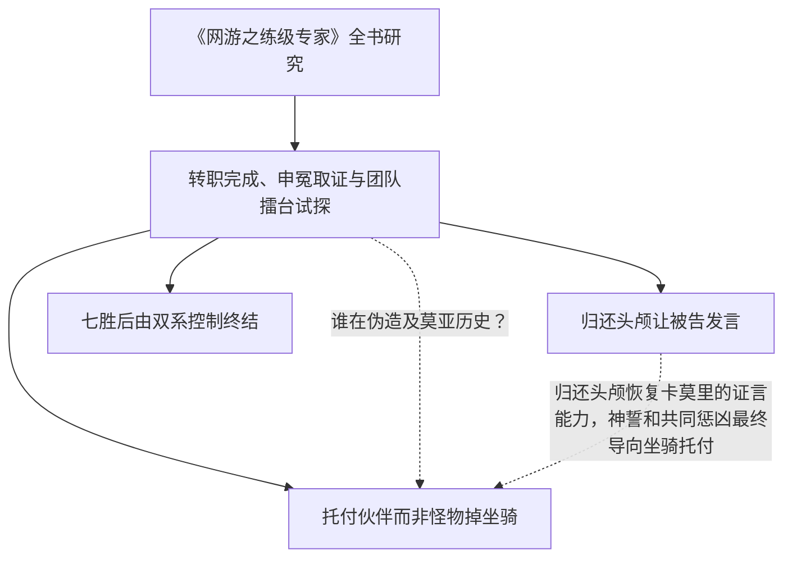

# 《网游之练级专家》转职完成、申冤取证与团队擂台试探

实线表示结构归属，虚线表示跨节点关系；依据类型详见节点数据。

```mermaid
flowchart TD
  n0["《网游之练级专家》全书研究"]
  n1["转职完成、申冤取证与团队擂台试探"]
  n0 --> n1
  n2["归还头颅让被告发言"]
  n1 --> n2
  n3["托付伙伴而非怪物掉坐骑"]
  n1 --> n3
  n4["七胜后由双系控制终结"]
  n1 --> n4
  n1 -. "谁在伪造及莫亚历史？" .-> n3
  n2 -. "归还头颅恢复卡莫里的证言能力，神誓和共同惩凶最终导向坐骑托付" .-> n3
```

## 剧情线
