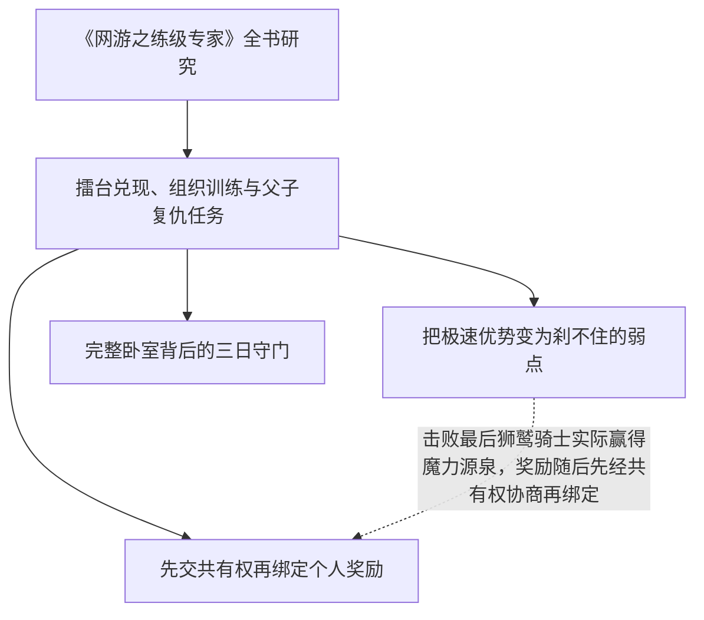

# 《网游之练级专家》擂台兑现、组织训练与父子复仇任务

实线表示结构归属，虚线表示跨节点关系；依据类型详见节点数据。

```mermaid
flowchart TD
  n0["《网游之练级专家》全书研究"]
  n1["擂台兑现、组织训练与父子复仇任务"]
  n0 --> n1
  n2["把极速优势变为刹不住的弱点"]
  n1 --> n2
  n3["先交共有权再绑定个人奖励"]
  n1 --> n3
  n4["完整卧室背后的三日守门"]
  n1 --> n4
  n2 -. "击败最后狮鹫骑士实际赢得魔力源泉，奖励随后先经共有权协商再绑定" .-> n3
```

## 剧情线
