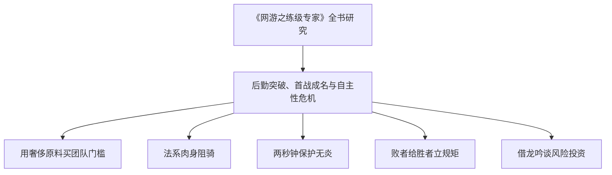

# 《网游之练级专家》后勤突破、首战成名与自主性危机

实线表示结构归属，虚线表示跨节点关系；依据类型详见节点数据。

```mermaid
flowchart TD
  n0["《网游之练级专家》全书研究"]
  n1["后勤突破、首战成名与自主性危机"]
  n0 --> n1
  n2["用奢侈原料买团队门槛"]
  n1 --> n2
  n3["法系肉身阻骑"]
  n1 --> n3
  n4["两秒钟保护无炎"]
  n1 --> n4
  n5["败者给胜者立规矩"]
  n1 --> n5
  n6["借龙吟谈风险投资"]
  n1 --> n6
```

## 剧情线
