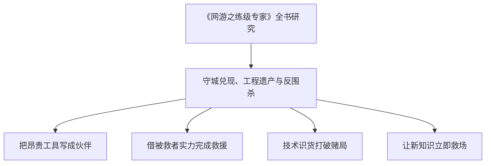

# 《网游之练级专家》守城兑现、工程遗产与反围杀

实线表示结构归属，虚线表示跨节点关系；依据类型详见节点数据。

```mermaid
flowchart TD
  n0["《网游之练级专家》全书研究"]
  n1["守城兑现、工程遗产与反围杀"]
  n0 --> n1
  n2["把昂贵工具写成伙伴"]
  n1 --> n2
  n3["借被救者实力完成救援"]
  n1 --> n3
  n4["技术识货打破赌局"]
  n1 --> n4
  n5["让新知识立即救场"]
  n1 --> n5
```

## 剧情线
