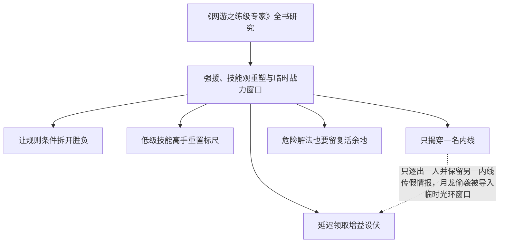

# 《网游之练级专家》强援、技能观重塑与临时战力窗口

实线表示结构归属，虚线表示跨节点关系；依据类型详见节点数据。

```mermaid
flowchart TD
  n0["《网游之练级专家》全书研究"]
  n1["强援、技能观重塑与临时战力窗口"]
  n0 --> n1
  n2["让规则条件拆开胜负"]
  n1 --> n2
  n3["低级技能高手重置标尺"]
  n1 --> n3
  n4["只揭穿一名内线"]
  n1 --> n4
  n5["延迟领取增益设伏"]
  n1 --> n5
  n6["危险解法也要留复活余地"]
  n1 --> n6
  n4 -. "只逐出一人并保留另一内线传假情报，月龙偷袭被导入临时光环窗口" .-> n5
```

## 剧情线
