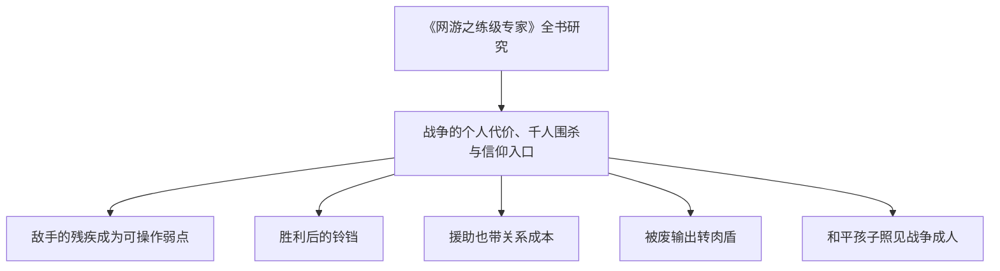

# 《网游之练级专家》战争的个人代价、千人围杀与信仰入口

实线表示结构归属，虚线表示跨节点关系；依据类型详见节点数据。

```mermaid
flowchart TD
  n0["《网游之练级专家》全书研究"]
  n1["战争的个人代价、千人围杀与信仰入口"]
  n0 --> n1
  n2["敌手的残疾成为可操作弱点"]
  n1 --> n2
  n3["胜利后的铃铛"]
  n1 --> n3
  n4["援助也带关系成本"]
  n1 --> n4
  n5["被废输出转肉盾"]
  n1 --> n5
  n6["和平孩子照见战争成人"]
  n1 --> n6
```

## 剧情线
