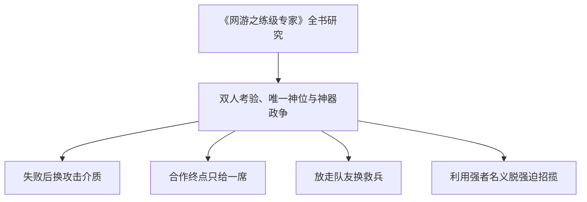

# 《网游之练级专家》双人考验、唯一神位与神器政争

实线表示结构归属，虚线表示跨节点关系；依据类型详见节点数据。

```mermaid
flowchart TD
  n0["《网游之练级专家》全书研究"]
  n1["双人考验、唯一神位与神器政争"]
  n0 --> n1
  n2["失败后换攻击介质"]
  n1 --> n2
  n3["合作终点只给一席"]
  n1 --> n3
  n4["放走队友换救兵"]
  n1 --> n4
  n5["利用强者名义脱强迫招揽"]
  n1 --> n5
```

## 剧情线
