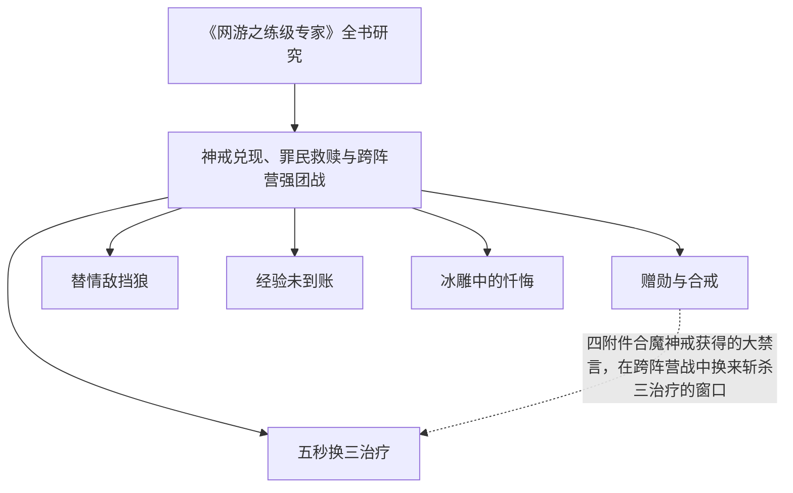

# 《网游之练级专家》神戒兑现、罪民救赎与跨阵营强团战

实线表示结构归属，虚线表示跨节点关系；依据类型详见节点数据。

```mermaid
flowchart TD
  n0["《网游之练级专家》全书研究"]
  n1["神戒兑现、罪民救赎与跨阵营强团战"]
  n0 --> n1
  n2["赠勋与合戒"]
  n1 --> n2
  n3["替情敌挡狼"]
  n1 --> n3
  n4["经验未到账"]
  n1 --> n4
  n5["冰雕中的忏悔"]
  n1 --> n5
  n6["五秒换三治疗"]
  n1 --> n6
  n2 -. "四附件合魔神戒获得的大禁言，在跨阵营战中换来斩杀三治疗的窗口" .-> n6
```

## 剧情线
