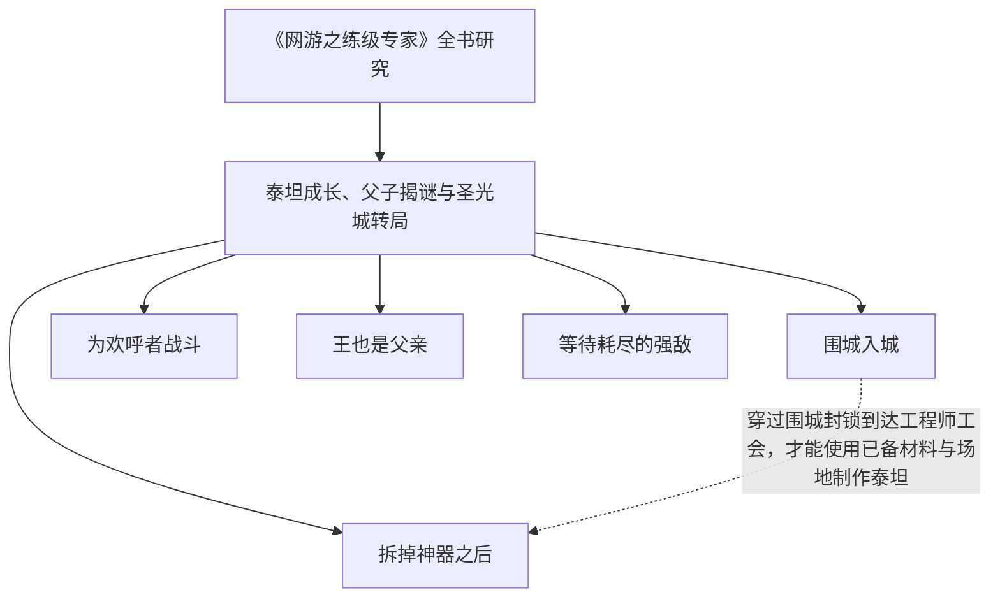

# 《网游之练级专家》泰坦成长、父子揭谜与圣光城转局

实线表示结构归属，虚线表示跨节点关系；依据类型详见节点数据。

```mermaid
flowchart TD
  n0["《网游之练级专家》全书研究"]
  n1["泰坦成长、父子揭谜与圣光城转局"]
  n0 --> n1
  n2["围城入城"]
  n1 --> n2
  n3["拆掉神器之后"]
  n1 --> n3
  n4["为欢呼者战斗"]
  n1 --> n4
  n5["王也是父亲"]
  n1 --> n5
  n6["等待耗尽的强敌"]
  n1 --> n6
  n2 -. "穿过围城封锁到达工程师工会，才能使用已备材料与场地制作泰坦" .-> n3
```

## 剧情线
