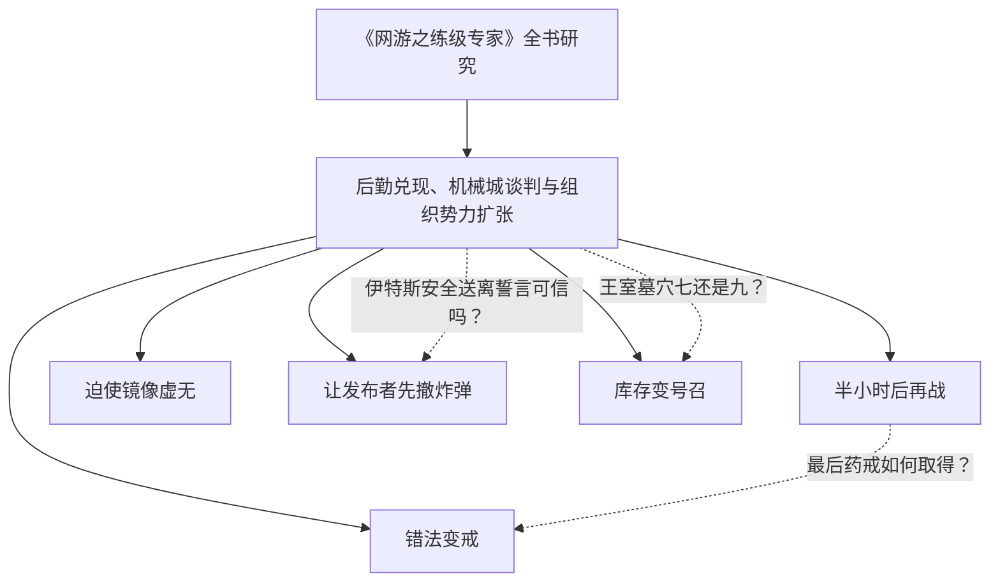

# 《网游之练级专家》后勤兑现、机械城谈判与组织势力扩张

实线表示结构归属，虚线表示跨节点关系；依据类型详见节点数据。

```mermaid
flowchart TD
  n0["《网游之练级专家》全书研究"]
  n1["后勤兑现、机械城谈判与组织势力扩张"]
  n0 --> n1
  n2["半小时后再战"]
  n1 --> n2
  n3["错法变戒"]
  n1 --> n3
  n4["迫使镜像虚无"]
  n1 --> n4
  n5["让发布者先撤炸弹"]
  n1 --> n5
  n6["库存变号召"]
  n1 --> n6
  n2 -. "最后药戒如何取得？" .-> n3
  n1 -. "伊特斯安全送离誓言可信吗？" .-> n5
  n1 -. "王室墓穴七还是九？" .-> n6
```

## 剧情线
