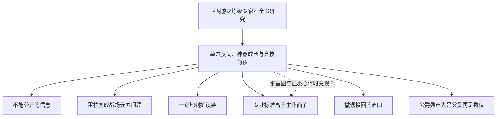

# 《网游之练级专家》墓穴反间、神器成长与竞技前夜

实线表示结构归属，虚线表示跨节点关系；依据类型详见节点数据。

```mermaid
flowchart TD
  n0["《网游之练级专家》全书研究"]
  n1["墓穴反间、神器成长与竞技前夜"]
  n0 --> n1
  n2["不能公开的信息"]
  n1 --> n2
  n3["雷柱变成战场元素问题"]
  n1 --> n3
  n4["一记地刺护读条"]
  n1 --> n4
  n5["专业标准高于主仆面子"]
  n1 --> n5
  n6["撤退换回蓝窗口"]
  n1 --> n6
  n7["公爵勋章先是父爱再是数值"]
  n1 --> n7
  n1 -. "水晶图与血羽心何时兑现？" .-> n5
```

## 剧情线
