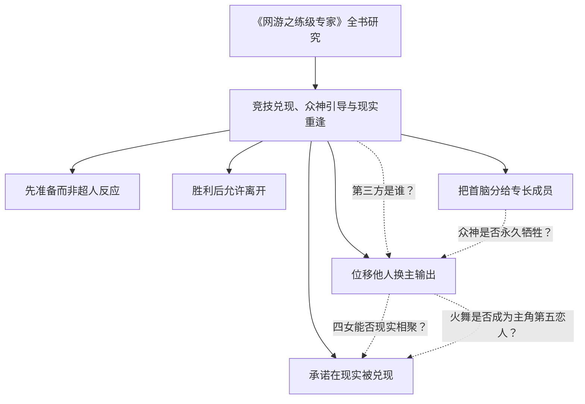

# 《网游之练级专家》竞技兑现、众神引导与现实重逢

实线表示结构归属，虚线表示跨节点关系；依据类型详见节点数据。

```mermaid
flowchart TD
  n0["《网游之练级专家》全书研究"]
  n1["竞技兑现、众神引导与现实重逢"]
  n0 --> n1
  n2["先准备而非超人反应"]
  n1 --> n2
  n3["胜利后允许离开"]
  n1 --> n3
  n4["把首脑分给专长成员"]
  n1 --> n4
  n5["位移他人换主输出"]
  n1 --> n5
  n6["承诺在现实被兑现"]
  n1 --> n6
  n1 -. "第三方是谁？" .-> n5
  n4 -. "众神是否永久牺牲？" .-> n5
  n5 -. "四女能否现实相聚？" .-> n6
  n5 -. "火舞是否成为主角第五恋人？" .-> n6
```

## 剧情线
