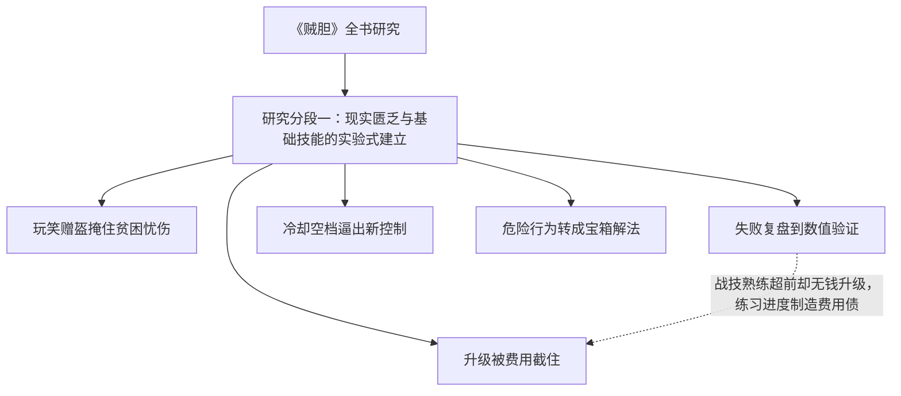

# 《贼胆》研究分段一：现实匮乏与基础技能的实验式建立

实线表示结构归属，虚线表示跨节点关系；依据类型详见节点数据。

```mermaid
flowchart TD
  n0["《贼胆》全书研究"]
  n1["研究分段一：现实匮乏与基础技能的实验式建立"]
  n0 --> n1
  n2["玩笑赠盔掩住贫困忧伤"]
  n1 --> n2
  n3["失败复盘到数值验证"]
  n1 --> n3
  n4["升级被费用截住"]
  n1 --> n4
  n5["冷却空档逼出新控制"]
  n1 --> n5
  n6["危险行为转成宝箱解法"]
  n1 --> n6
  n3 -. "战技熟练超前却无钱升级，练习进度制造费用债" .-> n4
```

## 剧情线
