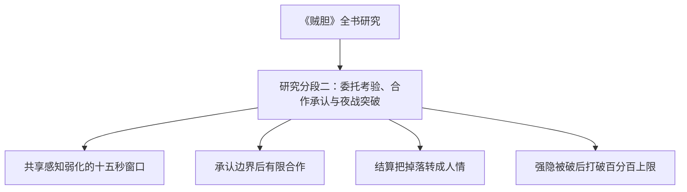

# 《贼胆》研究分段二：委托考验、合作承认与夜战突破

实线表示结构归属，虚线表示跨节点关系；依据类型详见节点数据。

```mermaid
flowchart TD
  n0["《贼胆》全书研究"]
  n1["研究分段二：委托考验、合作承认与夜战突破"]
  n0 --> n1
  n2["共享感知弱化的十五秒窗口"]
  n1 --> n2
  n3["承认边界后有限合作"]
  n1 --> n3
  n4["结算把掉落转成人情"]
  n1 --> n4
  n5["强隐被破后打破百分百上限"]
  n1 --> n5
```

## 剧情线
