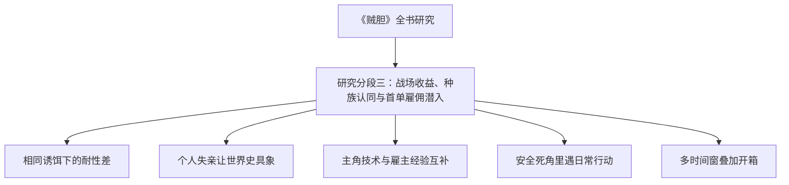

# 《贼胆》研究分段三：战场收益、种族认同与首单雇佣潜入

实线表示结构归属，虚线表示跨节点关系；依据类型详见节点数据。

```mermaid
flowchart TD
  n0["《贼胆》全书研究"]
  n1["研究分段三：战场收益、种族认同与首单雇佣潜入"]
  n0 --> n1
  n2["相同诱饵下的耐性差"]
  n1 --> n2
  n3["个人失亲让世界史具象"]
  n1 --> n3
  n4["主角技术与雇主经验互补"]
  n1 --> n4
  n5["安全死角里遇日常行动"]
  n1 --> n5
  n6["多时间窗叠加开箱"]
  n1 --> n6
```

## 剧情线
