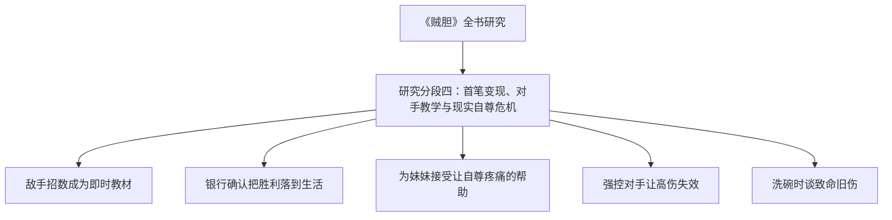

# 《贼胆》研究分段四：首笔变现、对手教学与现实自尊危机

实线表示结构归属，虚线表示跨节点关系；依据类型详见节点数据。

```mermaid
flowchart TD
  n0["《贼胆》全书研究"]
  n1["研究分段四：首笔变现、对手教学与现实自尊危机"]
  n0 --> n1
  n2["敌手招数成为即时教材"]
  n1 --> n2
  n3["银行确认把胜利落到生活"]
  n1 --> n3
  n4["为妹妹接受让自尊疼痛的帮助"]
  n1 --> n4
  n5["强控对手让高伤失效"]
  n1 --> n5
  n6["洗碗时谈致命旧伤"]
  n1 --> n6
```

## 剧情线
