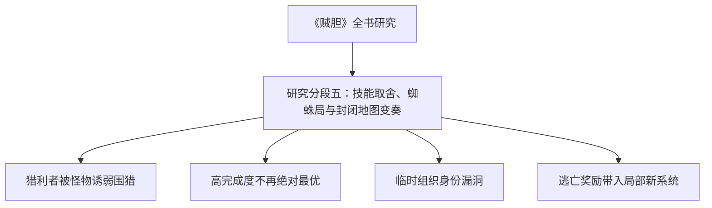

# 《贼胆》研究分段五：技能取舍、蜘蛛局与封闭地图变奏

实线表示结构归属，虚线表示跨节点关系；依据类型详见节点数据。

```mermaid
flowchart TD
  n0["《贼胆》全书研究"]
  n1["研究分段五：技能取舍、蜘蛛局与封闭地图变奏"]
  n0 --> n1
  n2["猎利者被怪物诱弱围猎"]
  n1 --> n2
  n3["高完成度不再绝对最优"]
  n1 --> n3
  n4["临时组织身份漏洞"]
  n1 --> n4
  n5["逃亡奖励带入局部新系统"]
  n1 --> n5
```

## 剧情线
