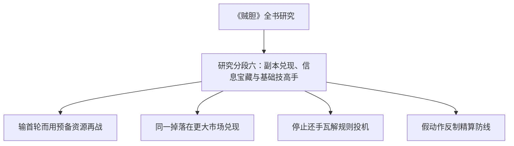

# 《贼胆》研究分段六：副本兑现、信息宝藏与基础技高手

实线表示结构归属，虚线表示跨节点关系；依据类型详见节点数据。

```mermaid
flowchart TD
  n0["《贼胆》全书研究"]
  n1["研究分段六：副本兑现、信息宝藏与基础技高手"]
  n0 --> n1
  n2["输首轮而用预备资源再战"]
  n1 --> n2
  n3["同一掉落在更大市场兑现"]
  n1 --> n3
  n4["停止还手瓦解规则投机"]
  n1 --> n4
  n5["假动作反制精算防线"]
  n1 --> n5
```

## 剧情线
