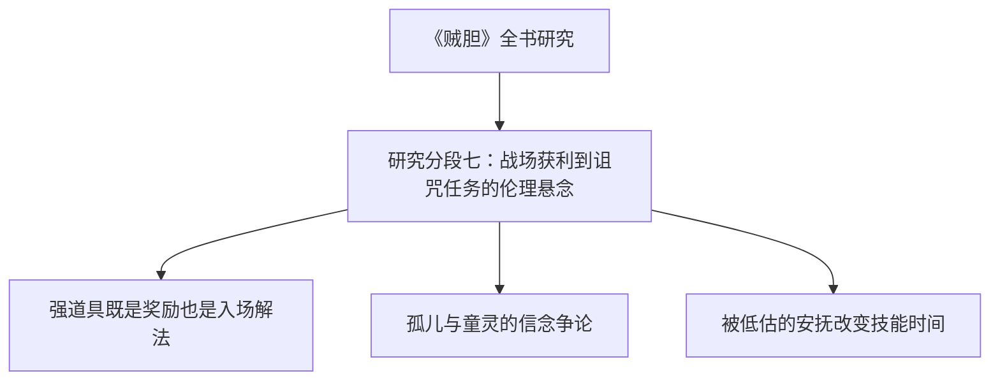

# 《贼胆》研究分段七：战场获利到诅咒任务的伦理悬念

实线表示结构归属，虚线表示跨节点关系；依据类型详见节点数据。

```mermaid
flowchart TD
  n0["《贼胆》全书研究"]
  n1["研究分段七：战场获利到诅咒任务的伦理悬念"]
  n0 --> n1
  n2["强道具既是奖励也是入场解法"]
  n1 --> n2
  n3["孤儿与童灵的信念争论"]
  n1 --> n3
  n4["被低估的安抚改变技能时间"]
  n1 --> n4
```

## 剧情线
