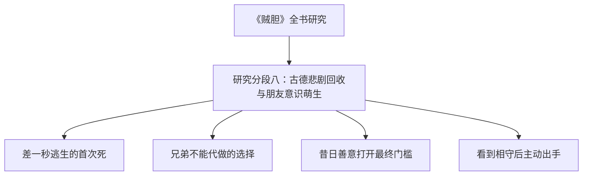

# 《贼胆》研究分段八：古德悲剧回收与朋友意识萌生

实线表示结构归属，虚线表示跨节点关系；依据类型详见节点数据。

```mermaid
flowchart TD
  n0["《贼胆》全书研究"]
  n1["研究分段八：古德悲剧回收与朋友意识萌生"]
  n0 --> n1
  n2["差一秒逃生的首次死"]
  n1 --> n2
  n3["兄弟不能代做的选择"]
  n1 --> n3
  n4["昔日善意打开最终门槛"]
  n1 --> n4
  n5["看到相守后主动出手"]
  n1 --> n5
```

## 剧情线
