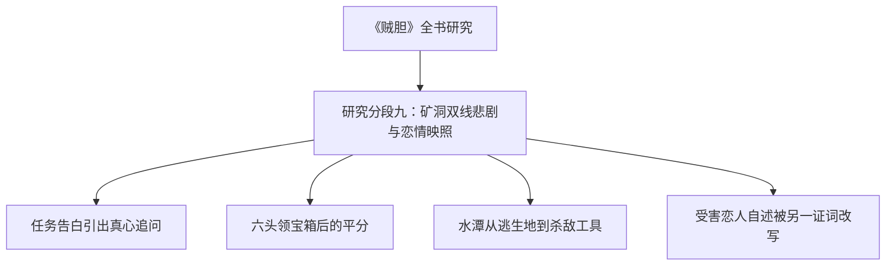

# 《贼胆》研究分段九：矿洞双线悲剧与恋情映照

实线表示结构归属，虚线表示跨节点关系；依据类型详见节点数据。

```mermaid
flowchart TD
  n0["《贼胆》全书研究"]
  n1["研究分段九：矿洞双线悲剧与恋情映照"]
  n0 --> n1
  n2["任务告白引出真心追问"]
  n1 --> n2
  n3["六头领宝箱后的平分"]
  n1 --> n3
  n4["水潭从逃生地到杀敌工具"]
  n1 --> n4
  n5["受害恋人自述被另一证词改写"]
  n1 --> n5
```

## 剧情线
