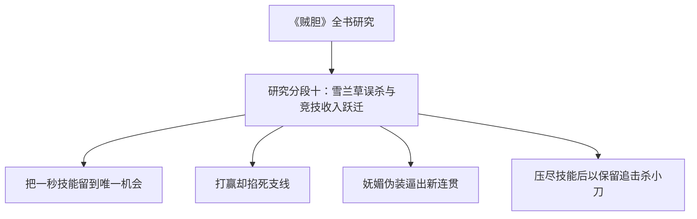

# 《贼胆》研究分段十：雪兰草误杀与竞技收入跃迁

实线表示结构归属，虚线表示跨节点关系；依据类型详见节点数据。

```mermaid
flowchart TD
  n0["《贼胆》全书研究"]
  n1["研究分段十：雪兰草误杀与竞技收入跃迁"]
  n0 --> n1
  n2["把一秒技能留到唯一机会"]
  n1 --> n2
  n3["打赢却掐死支线"]
  n1 --> n3
  n4["妩媚伪装逼出新连贯"]
  n1 --> n4
  n5["压尽技能后以保留追击杀小刀"]
  n1 --> n5
```

## 剧情线
