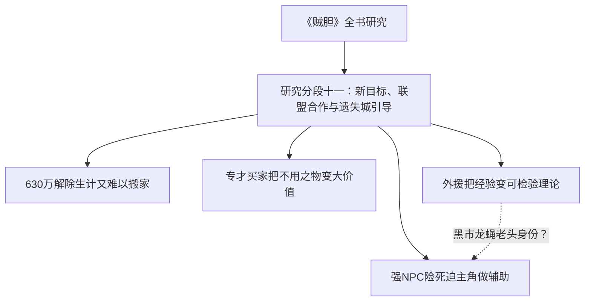

# 《贼胆》研究分段十一：新目标、联盟合作与遗失城引导

实线表示结构归属，虚线表示跨节点关系；依据类型详见节点数据。

```mermaid
flowchart TD
  n0["《贼胆》全书研究"]
  n1["研究分段十一：新目标、联盟合作与遗失城引导"]
  n0 --> n1
  n2["630万解除生计又难以搬家"]
  n1 --> n2
  n3["强NPC险死迫主角做辅助"]
  n1 --> n3
  n4["专才买家把不用之物变大价值"]
  n1 --> n4
  n5["外援把经验变可检验理论"]
  n1 --> n5
  n5 -. "黑市龙蝇老头身份？" .-> n3
```

## 剧情线
