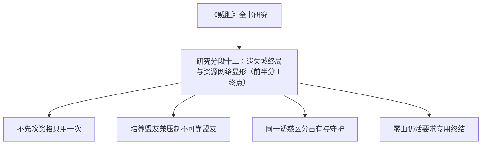

# 《贼胆》研究分段十二：遗失城终局与资源网络显形（前半分工终点）

实线表示结构归属，虚线表示跨节点关系；依据类型详见节点数据。

```mermaid
flowchart TD
  n0["《贼胆》全书研究"]
  n1["研究分段十二：遗失城终局与资源网络显形（前半分工终点）"]
  n0 --> n1
  n2["不先攻资格只用一次"]
  n1 --> n2
  n3["培养盟友兼压制不可靠盟友"]
  n1 --> n3
  n4["同一诱惑区分占有与守护"]
  n1 --> n4
  n5["零血仍活要求专用终结"]
  n1 --> n5
```

## 剧情线
