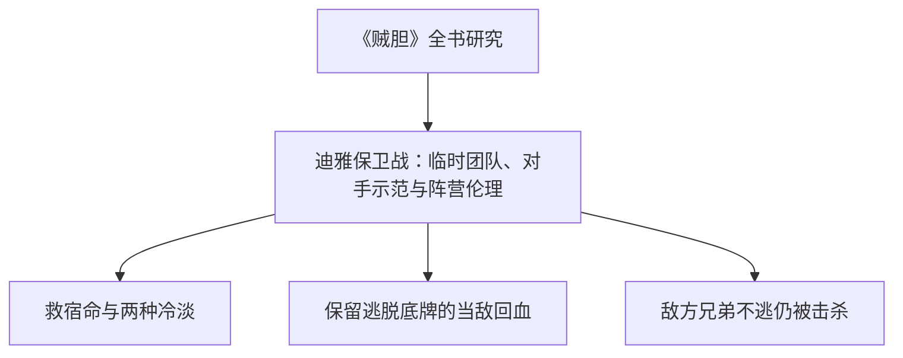

# 《贼胆》迪雅保卫战：临时团队、对手示范与阵营伦理

实线表示结构归属，虚线表示跨节点关系；依据类型详见节点数据。

```mermaid
flowchart TD
  n0["《贼胆》全书研究"]
  n1["迪雅保卫战：临时团队、对手示范与阵营伦理"]
  n0 --> n1
  n2["救宿命与两种冷淡"]
  n1 --> n2
  n3["保留逃脱底牌的当敌回血"]
  n1 --> n3
  n4["敌方兄弟不逃仍被击杀"]
  n1 --> n4
```

## 剧情线
