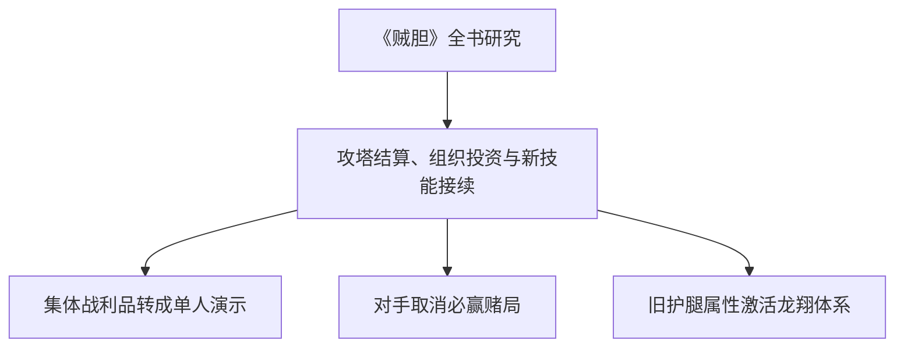

# 《贼胆》攻塔结算、组织投资与新技能接续

实线表示结构归属，虚线表示跨节点关系；依据类型详见节点数据。

```mermaid
flowchart TD
  n0["《贼胆》全书研究"]
  n1["攻塔结算、组织投资与新技能接续"]
  n0 --> n1
  n2["集体战利品转成单人演示"]
  n1 --> n2
  n3["对手取消必赢赌局"]
  n1 --> n3
  n4["旧护腿属性激活龙翔体系"]
  n1 --> n4
```

## 剧情线
