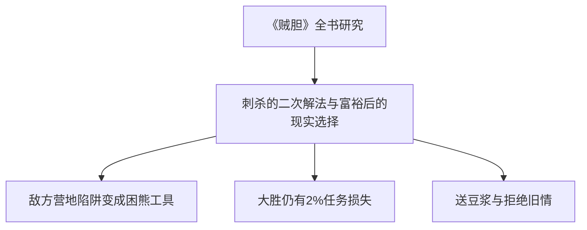

# 《贼胆》刺杀的二次解法与富裕后的现实选择

实线表示结构归属，虚线表示跨节点关系；依据类型详见节点数据。

```mermaid
flowchart TD
  n0["《贼胆》全书研究"]
  n1["刺杀的二次解法与富裕后的现实选择"]
  n0 --> n1
  n2["敌方营地陷阱变成困熊工具"]
  n1 --> n2
  n3["大胜仍有2%任务损失"]
  n1 --> n3
  n4["送豆浆与拒绝旧情"]
  n1 --> n4
```

## 剧情线
