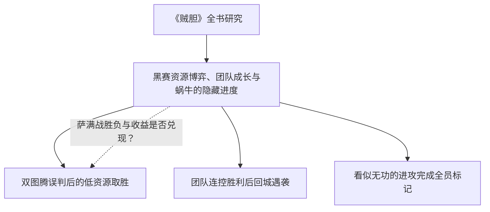

# 《贼胆》黑赛资源博弈、团队成长与蜗牛的隐藏进度

实线表示结构归属，虚线表示跨节点关系；依据类型详见节点数据。

```mermaid
flowchart TD
  n0["《贼胆》全书研究"]
  n1["黑赛资源博弈、团队成长与蜗牛的隐藏进度"]
  n0 --> n1
  n2["双图腾误判后的低资源取胜"]
  n1 --> n2
  n3["团队连控胜利后回城遇袭"]
  n1 --> n3
  n4["看似无功的进攻完成全员标记"]
  n1 --> n4
  n1 -. "萨满战胜负与收益是否兑现？" .-> n2
```

## 剧情线
