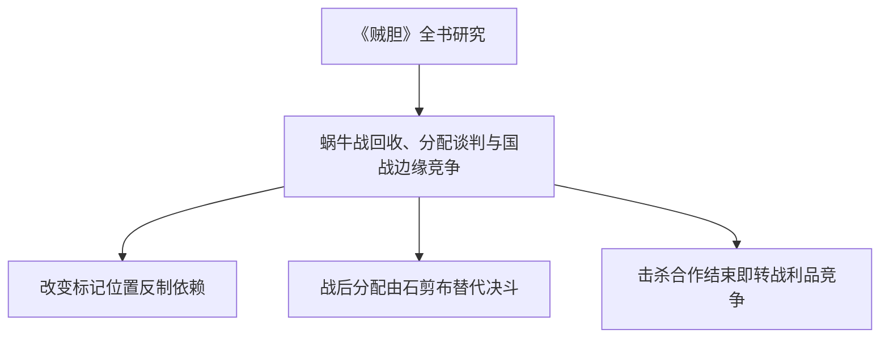

# 《贼胆》蜗牛战回收、分配谈判与国战边缘竞争

实线表示结构归属，虚线表示跨节点关系；依据类型详见节点数据。

```mermaid
flowchart TD
  n0["《贼胆》全书研究"]
  n1["蜗牛战回收、分配谈判与国战边缘竞争"]
  n0 --> n1
  n2["改变标记位置反制依赖"]
  n1 --> n2
  n3["战后分配由石剪布替代决斗"]
  n1 --> n3
  n4["击杀合作结束即转战利品竞争"]
  n1 --> n4
```

## 剧情线
