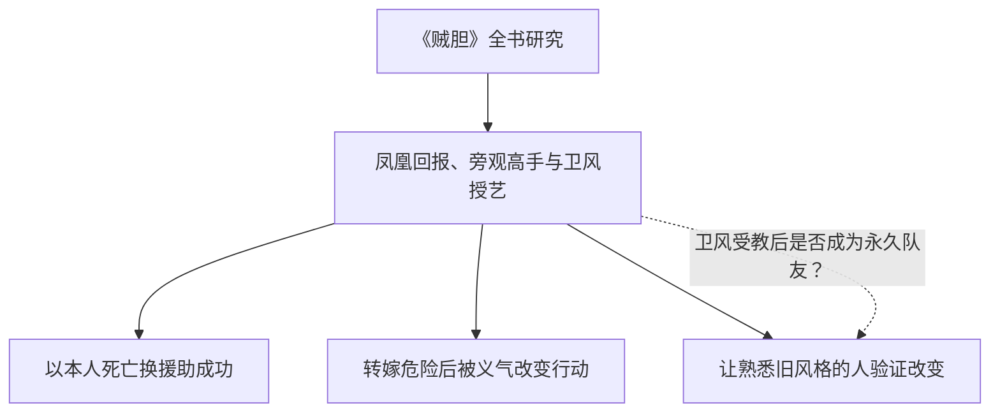

# 《贼胆》凤凰回报、旁观高手与卫风授艺

实线表示结构归属，虚线表示跨节点关系；依据类型详见节点数据。

```mermaid
flowchart TD
  n0["《贼胆》全书研究"]
  n1["凤凰回报、旁观高手与卫风授艺"]
  n0 --> n1
  n2["以本人死亡换援助成功"]
  n1 --> n2
  n3["转嫁危险后被义气改变行动"]
  n1 --> n3
  n4["让熟悉旧风格的人验证改变"]
  n1 --> n4
  n1 -. "卫风受教后是否成为永久队友？" .-> n4
```

## 剧情线
