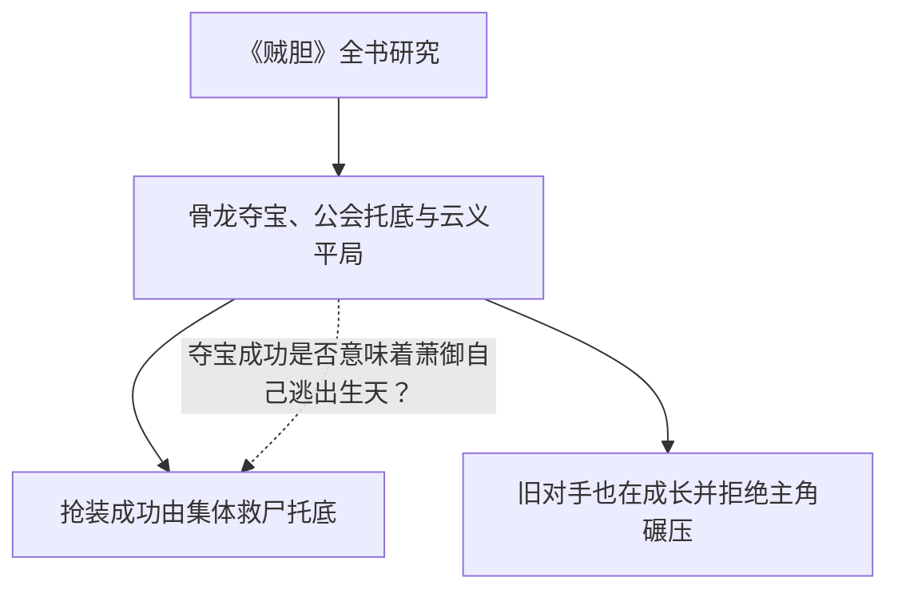

# 《贼胆》骨龙夺宝、公会托底与云义平局

实线表示结构归属，虚线表示跨节点关系；依据类型详见节点数据。

```mermaid
flowchart TD
  n0["《贼胆》全书研究"]
  n1["骨龙夺宝、公会托底与云义平局"]
  n0 --> n1
  n2["抢装成功由集体救尸托底"]
  n1 --> n2
  n3["旧对手也在成长并拒绝主角碾压"]
  n1 --> n3
  n1 -. "夺宝成功是否意味着萧御自己逃出生天？" .-> n2
```

## 剧情线
