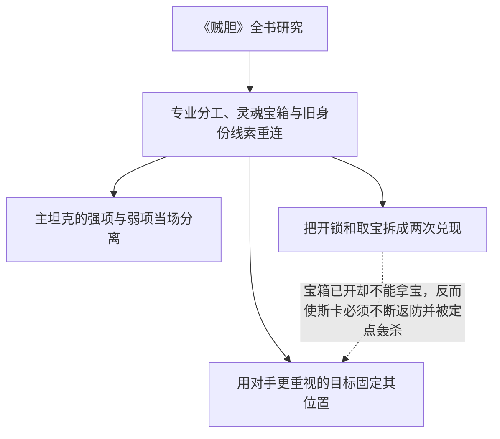

# 《贼胆》专业分工、灵魂宝箱与旧身份线索重连

实线表示结构归属，虚线表示跨节点关系；依据类型详见节点数据。

```mermaid
flowchart TD
  n0["《贼胆》全书研究"]
  n1["专业分工、灵魂宝箱与旧身份线索重连"]
  n0 --> n1
  n2["主坦克的强项与弱项当场分离"]
  n1 --> n2
  n3["把开锁和取宝拆成两次兑现"]
  n1 --> n3
  n4["用对手更重视的目标固定其位置"]
  n1 --> n4
  n3 -. "宝箱已开却不能拿宝，反而使斯卡必须不断返防并被定点轰杀" .-> n4
```

## 剧情线
