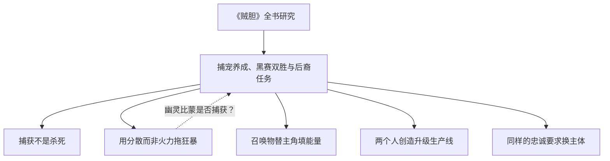

# 《贼胆》捕宠养成、黑赛双胜与后裔任务

实线表示结构归属，虚线表示跨节点关系；依据类型详见节点数据。

```mermaid
flowchart TD
  n0["《贼胆》全书研究"]
  n1["捕宠养成、黑赛双胜与后裔任务"]
  n0 --> n1
  n2["捕获不是杀死"]
  n1 --> n2
  n3["用分散而非火力拖狂暴"]
  n1 --> n3
  n4["召唤物替主角填能量"]
  n1 --> n4
  n5["两个人创造升级生产线"]
  n1 --> n5
  n6["同样的忠诚要求换主体"]
  n1 --> n6
  n3 -. "幽灵比蒙是否捕获？" .-> n1
```

## 剧情线
