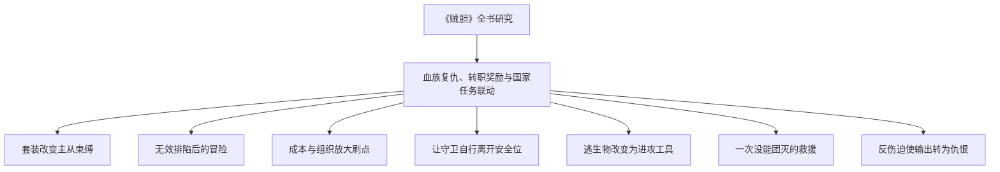

# 《贼胆》血族复仇、转职奖励与国家任务联动

实线表示结构归属，虚线表示跨节点关系；依据类型详见节点数据。

```mermaid
flowchart TD
  n0["《贼胆》全书研究"]
  n1["血族复仇、转职奖励与国家任务联动"]
  n0 --> n1
  n2["套装改变主从束缚"]
  n1 --> n2
  n3["无效排陷后的冒险"]
  n1 --> n3
  n4["成本与组织放大刷点"]
  n1 --> n4
  n5["让守卫自行离开安全位"]
  n1 --> n5
  n6["逃生物改变为进攻工具"]
  n1 --> n6
  n7["一次没能团灭的救援"]
  n1 --> n7
  n8["反伤迫使输出转为仇恨"]
  n1 --> n8
```

## 剧情线
