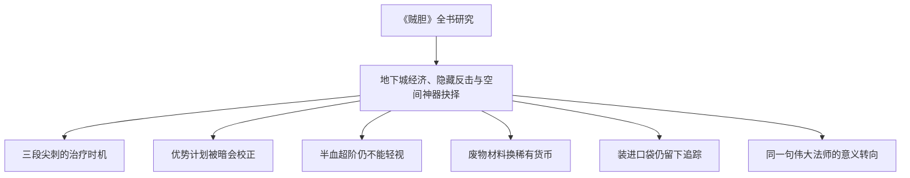

# 《贼胆》地下城经济、隐藏反击与空间神器抉择

实线表示结构归属，虚线表示跨节点关系；依据类型详见节点数据。

```mermaid
flowchart TD
  n0["《贼胆》全书研究"]
  n1["地下城经济、隐藏反击与空间神器抉择"]
  n0 --> n1
  n2["三段尖刺的治疗时机"]
  n1 --> n2
  n3["优势计划被暗会校正"]
  n1 --> n3
  n4["半血超阶仍不能轻视"]
  n1 --> n4
  n5["废物材料换稀有货币"]
  n1 --> n5
  n6["装进口袋仍留下追踪"]
  n1 --> n6
  n7["同一句伟大法师的意义转向"]
  n1 --> n7
```

## 剧情线
