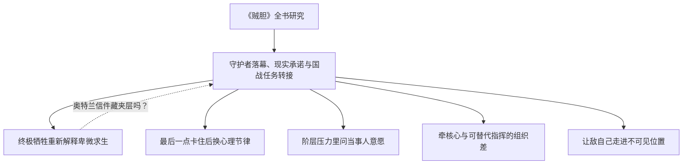

# 《贼胆》守护者落幕、现实承诺与国战任务转接

实线表示结构归属，虚线表示跨节点关系；依据类型详见节点数据。

```mermaid
flowchart TD
  n0["《贼胆》全书研究"]
  n1["守护者落幕、现实承诺与国战任务转接"]
  n0 --> n1
  n2["终极牺牲重新解释卑微求生"]
  n1 --> n2
  n3["最后一点卡住后换心理节律"]
  n1 --> n3
  n4["阶层压力里问当事人意愿"]
  n1 --> n4
  n5["牵核心与可替代指挥的组织差"]
  n1 --> n5
  n6["让敌自己走进不可见位置"]
  n1 --> n6
  n2 -. "奥特兰信件藏夹层吗？" .-> n1
```

## 剧情线
