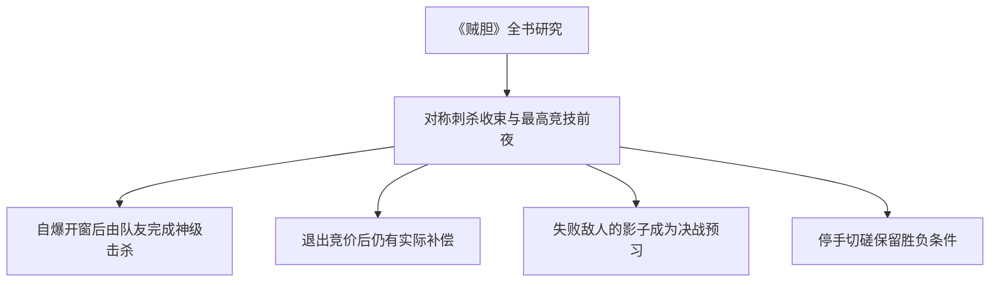

# 《贼胆》对称刺杀收束与最高竞技前夜

实线表示结构归属，虚线表示跨节点关系；依据类型详见节点数据。

```mermaid
flowchart TD
  n0["《贼胆》全书研究"]
  n1["对称刺杀收束与最高竞技前夜"]
  n0 --> n1
  n2["自爆开窗后由队友完成神级击杀"]
  n1 --> n2
  n3["退出竞价后仍有实际补偿"]
  n1 --> n3
  n4["失败敌人的影子成为决战预习"]
  n1 --> n4
  n5["停手切磋保留胜负条件"]
  n1 --> n5
```

## 剧情线
