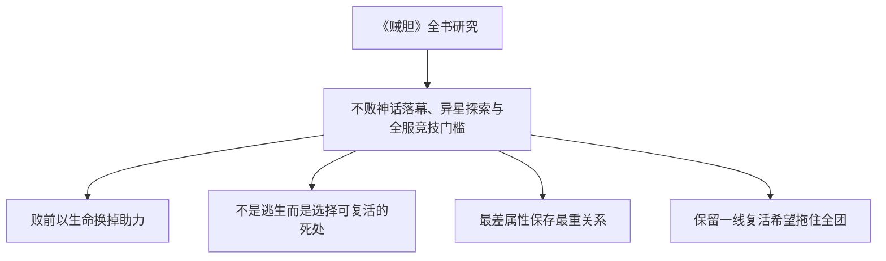

# 《贼胆》不败神话落幕、异星探索与全服竞技门槛

实线表示结构归属，虚线表示跨节点关系；依据类型详见节点数据。

```mermaid
flowchart TD
  n0["《贼胆》全书研究"]
  n1["不败神话落幕、异星探索与全服竞技门槛"]
  n0 --> n1
  n2["败前以生命换掉助力"]
  n1 --> n2
  n3["不是逃生而是选择可复活的死处"]
  n1 --> n3
  n4["最差属性保存最重关系"]
  n1 --> n4
  n5["保留一线复活希望拖住全团"]
  n1 --> n5
```

## 剧情线
