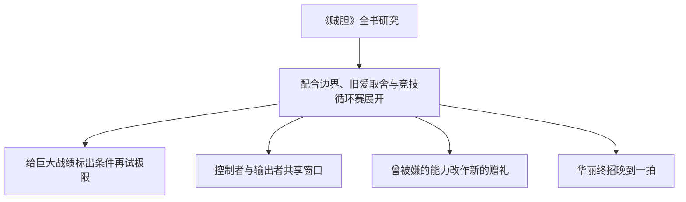

# 《贼胆》配合边界、旧爱取舍与竞技循环赛展开

实线表示结构归属，虚线表示跨节点关系；依据类型详见节点数据。

```mermaid
flowchart TD
  n0["《贼胆》全书研究"]
  n1["配合边界、旧爱取舍与竞技循环赛展开"]
  n0 --> n1
  n2["给巨大战绩标出条件再试极限"]
  n1 --> n2
  n3["控制者与输出者共享窗口"]
  n1 --> n3
  n4["曾被嫌的能力改作新的赠礼"]
  n1 --> n4
  n5["华丽终招晚到一拍"]
  n1 --> n5
```

## 剧情线
