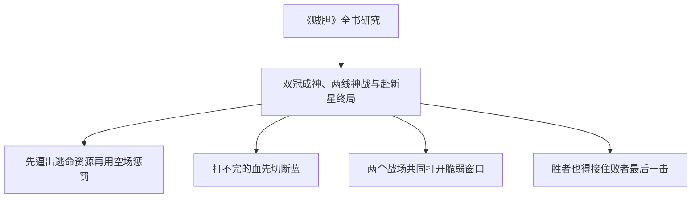

# 《贼胆》双冠成神、两线神战与赴新星终局

实线表示结构归属，虚线表示跨节点关系；依据类型详见节点数据。

```mermaid
flowchart TD
  n0["《贼胆》全书研究"]
  n1["双冠成神、两线神战与赴新星终局"]
  n0 --> n1
  n2["先逼出逃命资源再用空场惩罚"]
  n1 --> n2
  n3["打不完的血先切断蓝"]
  n1 --> n3
  n4["两个战场共同打开脆弱窗口"]
  n1 --> n4
  n5["胜者也得接住败者最后一击"]
  n1 --> n5
```

## 剧情线
